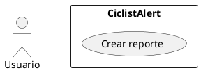

# CU001 : Creación de Reporte

---

**Descripción:**  Cualquier usuario puede crear un reporte o publicación especificando ciertos datos e incluyendo texto o imágenes

**Actor:** Deportista

## Flujo de Eventos (Guión)

| Actor  | Sistema |
|:-------|:---------|
| 1. Seleccionar opción "Crear reporte" | |
| | 2. Despliega interfaz creación de reporte  ||
|3. Seleccionar ubicación del reporte | |
| | 4. Almacenar ubicación |
|5. Hacer descripción textual | |
| 6. Seleccionar opción "Subir imágenes" | |
| | 7. Desplegar galería|
|8. Seleccionar imágenes  | |
| | 9. Almacenar imágenes seleccionadas|
|10. Seleccionar "Subir reporte" | |
| |11. Cargar reporte|
## Excepciones

10. Si no ha seleccionado una ubicación y desea cargar el reporte

| Actor  | Sistema |
|:-------|:---------|
| | 10.1. Muestra un mensaje "No se puede crear un reporte sin una ubicación" |

