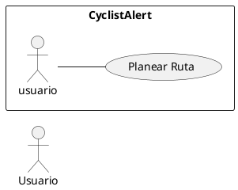

# CU002 : Planear Ruta
---

**Descripción:**  El Usuario selecciona un punto de destino, un punto de llegada y el sistema muestra los diferentes reportes creados dentro de esa ruta.

**Actor:** Usuario

## Flujo de Eventos (Guión)

| Actor  | Sistema |
|--------|---------|
| 1. Ingresa al módulo de "Planear ruta" ||
| | 2. Despliega el módulo |
| 3. Elige punto de partida en mapa | |
| 4. Elige punto de destino en mapa | |
| 5. Seleccionar opción "Planear Ruta" | |
| | 6. Mostrar puntos en mapa donde hayan reportes|

## Excepciones

5.1. No selecciona punto de partida, mostrar "Debe seleccionar punto de partida".
5.2. No selecciona punto de destino, mostrar "Debe seleccionar punto de destino".
