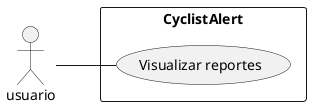

# CU003 - Visualización de reportes
---

**Descripción:**  El usuario puede ver todos los reportes que se han creado.

**Actor:** Usuario

## Flujo de Eventos (Guión)

| Actor  | Sistema |
|--------|---------|
| 1. Ingresa al feed||
| | 2. Se despliegan todos los reportes |
