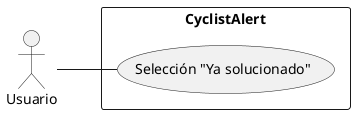

# CU004 - Selección "Ya solucionado"
---

**Descripción:**  El usuario cuando ve una publicación o reporte puede seleccionar la opción "Ya solucionado" que indica la corrección del hecho que se describió.

**Actor:** Usuario

## Flujo de Eventos (Guión)

| Actor  | Sistema |
|--------|---------|
| 1. Ingresa al feed ||
| | 2. Despliega todos los reportes |
| 3. Selecciona opción "Ya solucionado" de algún reporte|  |
| | 4. Almacena la data|

